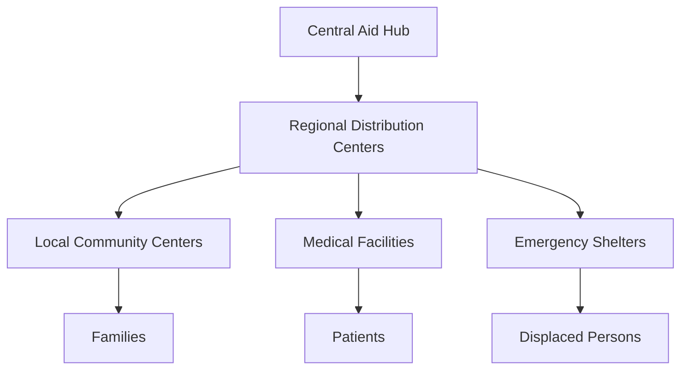

# Gaza Humanitarian Crisis Deepens: A Comprehensive Analysis

The humanitarian situation in Gaza continues to face unprecedented challenges as international organizations struggle to meet the growing needs of the civilian population. This in-depth report examines the current state of humanitarian aid delivery, healthcare infrastructure, and the international community's response.

## Current Situation

The crisis has reached critical levels with several key challenges:

- Severe shortages of essential medical supplies
- Limited access to clean water and sanitation
- Disrupted food supply chains
- Overwhelmed healthcare facilities
- Damaged infrastructure affecting aid distribution

## International Response

Multiple international organizations have intensified their efforts to address the growing humanitarian needs:

1. **UN Agencies**
   - UNRWA's expanded emergency response
   - WHO's medical supply coordination
   - UNICEF's child protection programs

2. **NGOs and Aid Organizations**
   - Médecins Sans Frontières (MSF) emergency medical teams
   - Red Cross/Red Crescent relief operations
   - Local NGO coordination efforts

## Healthcare Challenges

The healthcare system faces severe strain:

- Hospitals operating at maximum capacity
- Critical shortage of medical personnel
- Limited access to specialized medical equipment
- Increasing demand for emergency care

## Aid Distribution Networks

Humanitarian organizations have established various distribution networks:

## Looking Forward

The international community continues to work on:

- Establishing sustainable aid corridors
- Strengthening healthcare infrastructure
- Improving coordination between aid organizations
- Developing long-term support mechanisms

## How to Help

For those looking to support humanitarian efforts:

1. Donate to verified organizations
2. Spread awareness about the situation
3. Support advocacy efforts
4. Volunteer with local aid initiatives

## Resources

- [UN OCHA Situation Reports](https://www.unocha.org)
- [WHO Emergency Updates](https://www.who.int)
- [UNRWA Aid Programs](https://www.unrwa.org)
- [MSF Field Reports](https://www.msf.org)

---

*This article is regularly updated as new information becomes available. Last updated: April 15, 2024* 